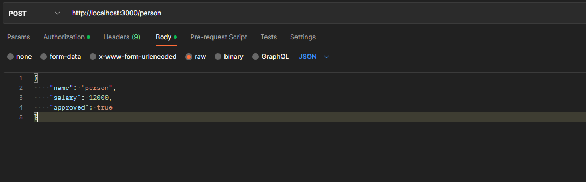

<p align="center" style="background-color:#fff">
  <a href="https://nodejs.org/" target="blank"></a>
</p>

## Project

<h3>
   using node js with express and mongodb to create a people registration api
</h3>
<br>

## Description

[Node](https://nodejs.org/) application made in node js.

<br>

## Installation

```bash
$ npm install
```

## Running the app

```bash
# development
$ npm run dev

```
## The app 


